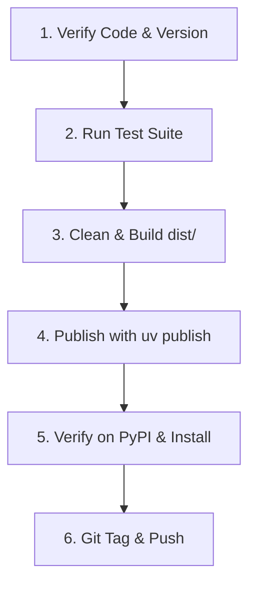

# PyPI Publishing Process

## Overview
Workflow for publishing releases of `mmisc` to the Python Package Index ([PyPI](https://pypi.org/project/mmisc/)).

---

## Authentication & Credentials

PyPI authentication uses an API token configured in `.env`:
```bash
export UV_PUBLISH_TOKEN=pypi-...
```

`uv publish` automatically detects `UV_PUBLISH_TOKEN` from the environment when loaded via `dotenv`.

---

## The Standard Release Process



### Step 1: Pre-flight Verification
1. Ensure the working directory is clean and changes are committed:
   ```bash
   git status
   ```
2. Verify the version number in [`pyproject.toml`](file:///home/mt/Documents/code/mmisc/pyproject.toml):
   ```toml
   [project]
   name = "mmisc"
   version = "0.1.4"
   ```
3. Run test suite:
   ```bash
   uv run pytest
   ```

### Step 2: Clean and Build Distribution Packages
Remove any outdated build artifacts and build a fresh source distribution (`.tar.gz`) and wheel (`.whl`):
```bash
rm -rf dist/
uv build
```

### Step 3: Publish to PyPI
Publish directly with `uv publish`:
```bash
dotenv run -- uv publish
```

### Step 4: Verification on PyPI
1. Visit the package page: [https://pypi.org/project/mmisc/](https://pypi.org/project/mmisc/)
2. In a clean environment, test installation:
   ```bash
   uv run --with "mmisc" python -c "import mmisc; print(mmisc.__file__)"
   ```

### Step 5: Git Tagging and Push
Once the release is live on PyPI, tag the release in git:
```bash
git tag v0.1.4
git push origin main --tags
```
